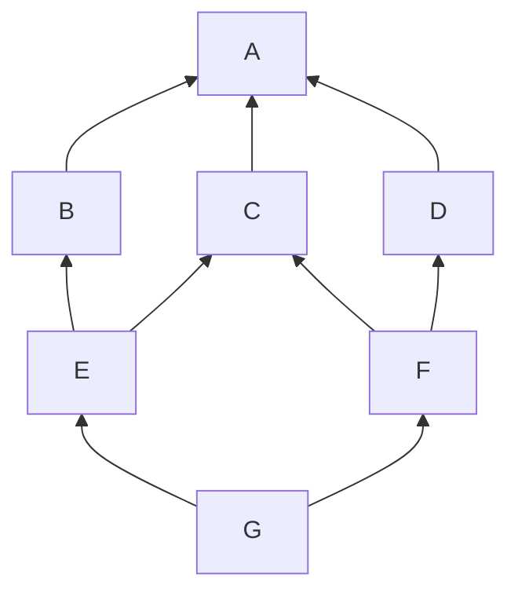

# Série 7 : Classes, le retour

[Solutions](https://github.com/epfl-cs-112-ma/solutions-serie-07)

Cette série a pour objectif de pratiquer les concepts avancés sur les classes Python, notamment l'héritage multiple et la variance.

Avant de commencer cette série, il est prévu que vous ayez suivi le second tutoriel de cette semaine :

* [Classes, le retour](/tutoriels/classes-le-retour.html)

Cette série ne contient aucun exercice lié aux *modules*.
Cela a peu de sens au sein d'une série.
Les modules sont utiles pour de plus gros programmes.
Nous espérons que vous vous en servirez judicieusement dans votre projet.

Nous vous recommandons de créer [un nouveau projet Python](/references/quick-projet-setup.html) pour chaque série d'exercices.
Cela vous permettra d'isoler plus facilement le contenu des différentes semaines.

Cette série contient 3 exercices :

{::options toc_levels="2" /}

* This will become a table of contents (this text will be scrapped).
{:toc}

## Explorer l'ordre de résolution des méthodes

Nous avons dit dans le tutoriel que, si on doit se poser la question de quelle méthode a priorité sur quelle autre, le design est douteux.
Cette exercice cherche à vous en convaincre.

Définissez les classes suivantes, puis exécutez la fonction `main()` :

```python
class A:
    def foo(self) -> None:
        print("A.foo")

class B(A):
    def foo(self) -> None:
        print("B.foo")
        super().foo()

class C(A):
    def foo(self) -> None:
        print("C.foo")
        super().foo()

class D(A):
    def foo(self) -> None:
        print("D.foo")
        super().foo()

class E(B, C):
    def foo(self) -> None:
        print("E.foo")
        super().foo()

class F(C, D):
    def foo(self) -> None:
        print("F.foo")
        super().foo()

class G(E, F):
    def foo(self) -> None:
        print("G.foo")
        super().foo()

def main() -> None:
    g = G()
    g.foo()

if __name__ == "__main__":
    main()
```

Observez les résultats.
Comparez-les avec le diagramme de classes ci-dessous :



L'ordre imprimé correspond à *l'ordre de résolution des méthodes* (*method resolution order*, **mro**).
Les méthodes qui ont imprimées d'abord ont priorité sur celles qui ont imprimé après.

Exécutez encore ce programme avec le *débogueur*, de façon à passer par chaque méthode une à une.

Vous pouvez aussi directement obtenir la liste des *classes* dans l'ordre mro avec

```python
print(G.__mro__)
```

Comme vous pouvez le constater, il est au mieux non intuitif, au pire très difficile, de prédire le mro.
Il est donc peu recommandé d'écrire des hiérarchies de classes ou le mro exact aura un impact sur votre programme.

Il existe deux propriétés simples, toujours vérifiées en Python, sur lesquelles on peut compter :

* Si `X` étend, directement ou indirectement, `Y`, alors `X.foo` est plus prioritaire que `Y.foo`.
* Si `X` étend les classes `Y` et `Z`, dans cet ordre, alors `Y.foo` est plus prioritaire que `Z.foo`.

Vérifiez que ces propriétés sont respectées par l'affichage que vous avez obtenu.

Tentez maintenant de définir une hiérarchie qui *empêche* cette propriété de pouvoir être vérifiée.
Par exemple, rajoutez `B` comme *première* classe parent de `G`.
Que se passe-t-il ?

La première des deux propriétés est la plus utile.
Si on la combine avec le *guide de design* suivant, on obtient toujours des hiérarchies où il est raisonnable de déterminer quelle méthode est prioritaire :

> Sauf raison impérieuse, une classe `A` ne devrait jamais étendre deux classes `B` et `C` qui définissent toutes deux une même méthode `m`.

Avec ce guide de design, on peut toujours tracer *une seule ligne*, du bas de la hiérarchie vers le haut (qui ne redescend jamais), qui passe par toutes les classes qui définissent `m`.
Cette ligne montre l'ordre de priorité pour `m` : les classes inférieures (descendantes) sont prioritaires sur les classes supérieures (ancêtres).

## Terraforming Mars

Dans le jeu [Terraforming Mars](https://boardgamegeek.com/boardgame/167791/terraforming-mars), les joueurs et joueuses incarnent différentes *corporations*.
Les corporations "collaborent" à la terraformation de Mars, mais c'est à qui en fera le plus pour impressionner les autorités, et ainsi recevoir plus de subventions.

Chaque corporation a ses spécificités.
Elles peuvent recevoir une action gratuite en début de partie, et/ou avoir un pouvoir permanent.
Les pouvoirs permanents sont de la forme "si tel événement se produit, gagner tel bonus".
Des événements peuvent être, par exemple "vous jouez une carte avec un badge Terre" ou "une corporation place une ville sur le jeu".
Les bonus peuvent être, par exemple, "recevez 5 M€", ou "augmentez votre production d'énergie de 1 unité", ou "réduisez le coût de la carte jouée de 2 M€".

Chaque corporation est aussi associée à un ou deux *badges*.

Il existe 16 types de badges différents.
Certains bonus sont octroyés en fonction du nombre de badges d'un type donné possédés par la corporation.

Au cours de la partie, les corporations peuvent jouer des *cartes*.
Toutes les cartes ont un effet sur le jeu lorsqu'elle sont jouées.
Elles ont aussi des spécificités en fonction de leur sorte :

* les cartes vertes apportent un ou plusieurs *badges* à leur propriétaire ;
* les cartes bleues donnent un pouvoir permanent, et apportent un ou plusieurs badges à leur propriétaire ;
* les cartes rouges n'ont rien de spécial.

**Modélisez** ces concepts au moyen de classes et de méthodes qui répondent aux différentes problématiques mentionnées.
En particulier, les notions de "jouer une carte", "compter les badges", et "appliquer des effets instantanés et/ou permanents".
Il ne faut pas implémenter les méthodes.

Vous pouvez résoudre cet exercice entièrement comme un diagramme sur une feuille de papier.

## Variance

Définissez les classes `Shape`, `Rectangle` et `Square` avec leur méthode `area()`.

Puis, définissez et testez les deux fonctions suivantes.

`biggest_shape` doit accepter une *liste* de `Shape`s et renvoyer celle dont l'aire est la plus grande.
Si on lui donne une `list[Rectange]`, elle doit renvoyer une `list[Rectangle]`, et de même avec des `list[Square]`.

`combine_shape_lists` doit accetper *deux* listes de `Shape`s, et renvoyer une nouvelle liste contenant les éléments des deux listes mises bout à bout (concaténées).
Si on lui passe deux `list[Shape]`, elle doit renvoyer une `list[Shape]`.
Si on lui passe deux `list[Rectangle]`, elle doit renvoyer une `list[Shape]`.
Plus dur : si on lui passe une `list[Rectangle]` et une `list[Square]`, elle doit renvoyer une `list[Shape]`.
