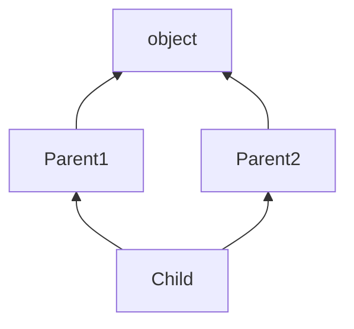
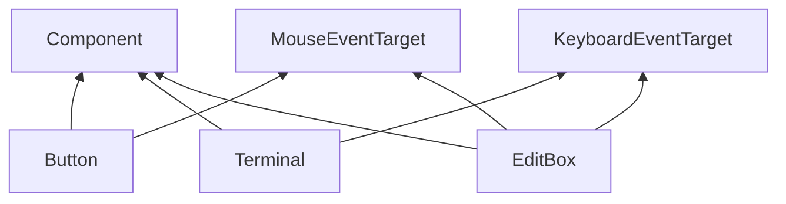
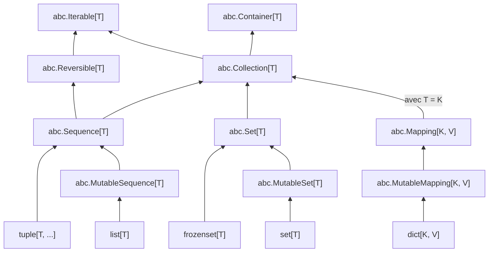

# Classes, le retour

Ce chapitre revient sur quelques notions plus avancées avec les classes en Python.

## Sommaire

{::options toc_levels="2..3" /}

* This will become a table of contents (this text will be scrapped).
{:toc}

## Attributs de classe

Nous avons vu que, dans une classe, on peut déclarer des attributs qu'auront les *instances* de cette classe.
On initialise ces attributs dans la méthode `__init__` de la classe :

```python
class Disk:
    radius: Final[float]

    def __init__(self, radius: float) -> None:
        self.radius = radius
```

Avec cette définition, bien que ça puisse en avoir l'air, il n'existe pas de variable `Disk.radius`.
Seules les *instances* de `Disk` ont un attribut `radius`.

Par ailleurs, vous avez déjà remarqué que vous pouviez déclarer des variables *globales* dans un [module](./modules.html).
Par exemple :

```python
PI: Final[float] = 3.141592653589793

class Disk:
    ...

    def area(self) -> float:
        return 2.0 * PI * self.radius
```

Si une telle variable globale est fortement liée à une classe, on peut choisir de la déclarer comme *attribut de classe*.
Cela se fait comme pour une variable globale, mais à l'intérieur du bloc qui définit la classe.
L'exemple est douteux ici (`PI` a bien plus d'usages que les disques), mais pour l'illustration, nous pouvons définir `PI` comme attribut de la classe `Disk`.

```python
class Disk:
    # définition d'un attribut de classe
    PI: Final[float] = 3.141592653589793

    # déclaration d'un attribut d'instance
    radius: Final[float]

    def __init__(self, radius: float) -> None:
        # définition (via initialisation) de l'attribut d'instance
        self.radius = radius

    def area(self) -> float:
        return 2.0 * Disk.PI * self.radius # usage d'un attribut de classe
```

Notez que l'usage a changé.
On fait maintenant référence à `Disk.PI`.

**⚠️ Attention !**
En Python, il y a syntaxiquement très peu de différence entre la *définition* d'un attribut de classe, et la *déclaration* d'un attribut d'instance.
Ne confondez pas les deux.
Une déclaration d'attribut d'instance n'a pas de `=` ; seulement un type.
La *définition* correspondante a lieu sur `self.`, dans la méthode `__init__`.
La définition d'un attribut de classe possède bien un `=`.

Une erreur typique est de croire que `foo: int = 5` dans une `class` définit un attribut d'instance `foo`, qui est *initialisé* à `5`.
On peut alors croire que chaque instance reçoit son propre `foo` et peut le modifier plus tard à sa guise.
C'est incorrect !
Il s'agit dans cette situation d'un attribut de classe, qui est partagé entre toutes les instances.
Les attributs d'instance doivent *toujours* être initialisés dans la méthode `__init__`, et non dans le corps de la classe.

### État global muable = danger

Les attributs de classes, comme les variables globales dans un module, sont *uniques*.
Elles sont partagées entre tous les codes utilisateur de ces attributs.
Où qu'ils soient dans le programme.

C'est raisonnable pour des *constantes*, autrement dit des données *immuables*.
Ça ne veut pas dire que ce sont forcément des primitives.
Il est parfaitement possible d'avoir des constantes instances de classes immuables.

En revanche, **il faut à tout prix éviter** d'avoir de l'état global *muable*.
Tous les attributs de classe, et toutes les variables globales, devraient toujours être `Final` *et* instances de types immuables.

`PI: Final[float]` est acceptable pour un attribut de classe, puisque `float` est immuable.
`PI: float` ne l'est pas, puisqu'on peut alors modifier sa valeur.
De même, `SOME_LIST: Final[list[int]]` n'est pas acceptable, puisque `list` est une classe muable ; même si la variable est `Final`, rien n'empêche de modifier le *contenu* de la liste.
Rappelez-vous que `Final` empêche uniquement de changer la *flèche*, la *référence* stockée dans `SOME_LIST`.
Une fois qu'on a suivi la flèche, c'est la classe qui détermine si elle muable ou non.

### Les méthodes vues comme attributs de classe

Détail un peu spécifique à Python, les méthodes --- qui manipulent des instances --- sont en fait des attributs de la classe !
Étant donnée la classe `Disk` ci-dessus, on peut, sur le papier, appeler ses méthodes de la façon détournée suivante.

```python
d = Disk(5.1)
print(Disk.area(d)) # 32.044245066615886
```

En revanche, évitez de faire cela dans du code réel ; cela porte énormément à confusion.

Techniquement, en Python, lorsqu'on appelle `d.area()` (comme on est censé le faire), les étapes suivantes se passe :

1. On lit `d.area`, qui est une *propriété* des instances de `Disk` (créée automatiquement par la présence de la fonction comme attribut de la classe).
2. Le "getter" de cette propriété renvoie une nouvelle fonction `f`, qu'on pourrait écrire comme `def area_for_d() -> float: return Disk.area(d)`.
3. On appelle ensuite cette fonction `area_for_d()`, ce qui a pour effet d'appeler `Disk.area` avec `d` en argument.

### Méthodes statiques

Peut-on alors définir des méthodes qui appartiendraient réellement à la classe, et non à ses instances ?
Des méthodes qui seraient donc comme des attributs de classe.

C'est le rôle des méthodes dites *statiques*.
En Python, on définit une méthode statique avec l'annotation `@staticmethod`.
Une méthode statique ne prend *pas* de paramètre `self`.

```python
class Math:
    @staticmethod
    def add(x: float, y: float) -> float:
        return x + y

print(Math.add(3.2, 4.1)) # 7.3
```

### Méthodes de classe

Il existe aussi les *méthodes de classe* en Python.
Nous les mentionnons ici seulement que pour que vous sachiez que ça existe, et que c'est *différent* des méthodes statiques.
Les méthodes de classe sont définies avec l'annotation `@classmethod`.
Elles ne prennent pas de paramètre de `self`, mais elles prennent un paramètre `cls` à la place, qui représente la classe elle-même.

```python
class Math:
    @classmethod
    def add(cls, x: float, y: float) -> float:
        return x + y

print(Math.add(3.2, 4.1)) # 7.3
```

Si vous voulez en savoir plus sur les méthodes de classes, je vous renvoie [à une question sur le sujet sur StackOveflow](https://stackoverflow.com/questions/136097/what-is-the-difference-between-staticmethod-and-classmethod-in-python), qui sera un bon point de départ.

## Héritage multiple

En Python, une classe peut étendre *plusieurs* classes.
C'est ce qu'on appelle l'héritage multiple.
Ci-dessous, la classe `Child` étend à la fois `Parent1` et `Parent2`.

```python
class Parent1: pass
class Parent2: pass
class Child(Parent1, Parent2): pass
```

Si on ne définit *aucune* classe parent, toute classe étend implicitement `object`.
Les définitions ci-dessous sont donc équivalentes :

```python
class Parent1(object): pass
class Parent2(object): pass
class Child(Parent1, Parent2): pass
```

On alors les relations d'héritage suivantes :



Les attributs et méthodes définies dans `Parent1` et dans `Parent2` sont toutes héritées par `Child` :

```python
class Parent1(object):
    x: int

    def __init__(self, x: int) -> None:
        self.x = x

    def foo(self, y: int) -> int:
        return self.x + y

class Parent2(object):
    def bar(self, z: int) -> int:
        return z + 1

class Child(Parent1, Parent2):
    def __init__(self, x: int) -> None:
        super().__init__(x)

def main() -> None:
    child = Child(5)
    print(child.foo(11)) # 16
    print(child.bar(12)) # 13
```

Remarquez que nous n'avons pas défini de méthode `__init__` dans `Parent2`.
Nous y reviendrons.

Chaque parent donne lieu à une relation de *sous-typage* associée :

* `Child <: Parent1`
* `Child <: Parent2`

### Membres hérités par deux chemins

Le fait que `object` se retrouve "doublement" ancêtre de `Child` n'est qu'un cas particulier.
Cela peut se produire avec n'importe quelle classe "normale" :

```python
class A:
    x: int

    def __init__(self, x: int) -> None:
        self.x = x

    def foo(self) -> int:
        return self.x

class B(A): pass
class C(A): pass
class D(B, C): pass

def main() -> None:
    d = D(5)
    print(d.x)
    print(d.foo())
```

Lorsqu'un tel "diamant" se produit, `D` n'hérite qu'une seule fois des membres de la classe ancêtre `A`.
Lorsqu'on appelle `d.foo()`, on cherche dans la hiérarchie de `D` pour trouver "la première" classe qui définit `foo()`.

Que se passe-t-il si plusieurs classes définissent `foo()` ?
Si `B` ou `C` redéfinit `foo()` (par surcharge/overriding), c'est la sous-classe qui gagne, comme nous l'avons déjà vu.
Mais si `B` *et* `C` définissent `foo()`, qui gagne ?

```python
class A:
    ...
    def foo(self) -> str:
        return "A.foo"

class B(A):
    def foo(self) -> str:
        return "B.foo"

class C(A):
    def foo(self) -> str:
        return "C.foo"

class D(B, C): pass

def main() -> None:
    d = D(5)
    print(d.foo())
```

Dans ce cas, on observe que c'est `B.foo` qui est affiché.
C'est parce que `B` apparaît à gauche de `C` dans les classes parent de `D`.

En l'absence de relation de *surcharge* ou *d'implémentation de méthode abstraite* due à une relation d'héritage direct, [l'ordre de recherche est compliqué](https://docs.python.org/3/howto/mro.html).
Généralement, **si vous devez vous poser la question, c'est que votre design est douteux**.
En principe, vous devriez éviter d'étendre deux classes qui définissent toutes deux la même méthode (non abstraite).

### Le cas de `__init__`

Qu'en est-il alors de `__init__` ?
N'avons-nous pas dit que toute classe devrait avoir une méthode `__init__` afin d'initialiser ses attributs ?
Dans ce cas, nous aurons inévitablement des problèmes entre la méthode `B.__init__` et `C.__init__`.

La première partie de la réponse à cette problématique est qu'il n'est pas toujours nécessaire de définir une méthode `__init__`.
Si la seule chose qu'une méthode `__init__` veut faire, c'est appeler `super().__init__(...)` avec les mêmes arguments, alors on peu l'omettre complètement.
Si nous avions défini une méthode `__init__` dans `B`, elle aurait suivi ce motif :

```python
class B(A):
    def __init__(self, x: int) -> None:
        super().__init__(x)
```

Comme elle ne fait rien d'autre que de déléguer à la méthode `super().__init__`, on peut omettre la définition de `B.__init__` entièrement.
De la même façon, on n'a pas besoin de `C.__init__`.

On n'a donc pas le problème des définitions multiples.

La deuxième partie de la réponse, c'est que, *dans de bons designs*, les différents parents d'une classe ne sont pas symétriques.
Le premier parent a le droit d'avoir une méthode `__init__`.
Les parents suivants ne devraient pas définir de méthode `__init__` eux-mêmes.

De manière générale, à partir d'une classe `D`, on crée la chaîne des *premiers parents* : `D -> B -> A`.
Seules ces classes ont le droit d'avoir une méthode `__init__`.
De cette manière, on s'assure que la chaîne d'initialisation reste claire.

Notez que ceci n'est pas une restriction de Python.
Il est techniquement *possible* d'avoir une méthode `__init__` dans une des classes "de droite".
Cependant, un design dans lequel cela se produit devrait toujours être remis en question.

### Classes de base abstraites

Si on ne peut pas mettre de méthode `__init__` dans les classes "de droite", on ne peut pas vraiment y déclarer d'attributs non plus.
Quel est alors leur rôle ?

Souvent, elles ne vont contenir *que des méthodes abstraites*.
Elles agissent donc exclusivement comme *interface*, sans implémentation.

Python appelle ces classes des "classes de base abstraites", ou *abstract base classes* (`abc`).
D'autres langages, comme Java, les appellent littéralement des *interfaces*.

Il est possible pour ces classes d'avoir aussi des méthodes concrètes.
Dans ce cas, elles vont presque toujours déléguer une partie de leur comportement à d'autres méthodes de la classe.
D'une manière ou d'une autre, on aboutit presque systématiquement sur une méthode abstraite, qui devra être implémentée dans les classes enfants.

### Un exemple concret

Les situations qui appellent réellement de l'héritage multiple sont assez rares.
Parmi les exemples les plus répandus, on trouve les cas d'interface graphique.

Plusieurs types de *composants* graphiques peuvent réagir au clic souris (ex. : un bouton), et plusieurs peuvent réagir aux événements du clavier (ex. : une fenêtre de terminal/shell).
Certains composants veulent pouvoir réagir aux deux (ex. : un boîte de texte que l'on peut éditer et sélectionner).
Dans tous les cas, tous les composants doivent pouvoir être dessinés à l'écran.

On pourrait alors avoir une hiérarchie ressemblant à ceci :

```python
class Component:
    @abstractmethod
    def draw(self) -> None: ...

class MouseEventTarget:
    @abstractmethod
    def click(self) -> None: ...

class KeyboardEventTarget:
    @abstractmethod
    def press_key(self, key: int) -> None: ...

class Button(Component, MouseEventTarget): ...
class Terminal(Component, KeyboardEventTarget): ...
class EditBox(Component, MouseEventTarget, KeyboardEventTarget): ...
```



Cet exemple se généralise à d'autres situations de "gestion d'événements".
Les événements sont regroupés en abc's, et les classes qui veulent réagir à tel ou tel type d'événements étendent les abc's correspondantes.

### Des abc's dans la bibliothèque standard

Il y a deux semaines, nous avons vu plusieurs [structures de données](./structures-de-donnees.html) disponibles en Python.
Parmi elles, nous avions mentionné `collections.abc.Sequence[T]` comme un super-type de `list[T]` et `tuple[T, ...]`, entre autres.
Cette classe fait partie d'un ensemble d'abc's de la bibliothèque standard.

En voici quelques autres, avec les relations d'héritage entre les structures.



Tout en haut de cette hiérarchie, nous trouvons `abc.Iterable[T]`, qui est la classe de base pour tout ce sur quoi on peut itérer avec une boucle `for` ou une comprehension.

Vous pourrez trouver la référence complète [dans la documentation de Python](https://docs.python.org/3/library/collections.abc.html).

### Protocoles

Pour une compréhension plus en profondeur, [lisez la documentation de mypy sur les *protocoles*](https://mypy.readthedocs.io/en/stable/protocols.html).
Les protocoles peuvent être vus comme une généralisation du méchanisme d'héritage multiple.

## Variance

Il nous reste un dernier sujet à revisiter, qui concerne en particulier le *sous-typage*.
Dans notre chapitre sur le [polymorphisme](./heritage-et-polymorphisme.html#héritage-et-sous-typage), puis plus tard sur les [génériques](./generiques-et-lambdas.html#héritage-entre-classes-génériques), nous avons mentionné que les relations d'héritage sont accompagnées de relations de *sous-typage* entre les types associés.

Par exemple, `list[A] <: abc.Sequence[A]` est bien vraie, car `list[T]` est définie comme

```python
class list[T](abc.Sequence[T]): ...
```

Cependant, nous n'avons rien dit au sujet d'une relation entre `list[B]` et `list[A]`.
Si `B <: A`, est-il vrai que `list[B] <: list[A]` ?
Intuitivement, on pourrait penser que oui.

Pourtant, vous avez peut-être déjà remarqué que mypy vous dit que non.
Peut-être avez-vous essayé de mettre une `list[B]` comme élément d'une `list[list[A]]` ?
Ou peut-être une `SpriteList[B]` dans une `list[SpriteList[A]]` ?

### `list` est invariante

On peut démontrer que `list[B] <: list[A]` poserait problème comme suit :

```python
class A:
    pass

class B(A):
    def b_method(self) -> int:
        return 42

def break_subtyping() -> None:
    list_b: list[B] = []
    list_a: list[A] = list_b # erreur
    list_a.append(A())
    fake_b: B = list_b[0]
    print(fake_b.b_method())
```

Mypy nous dit bien qu'il y a une erreur sur la ligne indiquée :

> Incompatible types in assignment (expression has type `list[B]`, variable has type `list[A]`)

Si on exécute quand même cette fonction, ignorant l'erreur de mypy, on obtient un gros problème à l'exécution :

```
  File "main.py", line 23, in main
    break_subtyping()
    ~~~~~~~~~~~~~~~^^
  File "main.py", line 20, in break_subtyping
    print(fake_b.b_method())
          ^^^^^^^^^^^^^^^
AttributeError: 'A' object has no attribute 'b_method'
```

En prétendant que `list_b` était une `list[A]`, nous avons pu insérer une instance de `A` dans `list_b`.
On a alors récupéré cette instance comme `fake_b: B`, et on a appelé une méthode qui n'existe que sur `B`.
Comme `fake_b` est en fait un `A`, cela produit une erreur.

Mypy avait donc raison de ne pas nous laisser faire !
Il savait que `list[B] <: list[A]` était une erreur.
La raison profonde est qu'une telle relation de sous-typage viole le [principe de substitution de Liskov](./heritage-et-polymorphisme.html#principe-de-substitution-de-liskov).
Rappelons sa formulation "de tous les jours" ici :

> Si $S <: T$, alors tout ce qu'on peut faire avec une valeur de type $T$, on doit aussi pouvoir le faire avec une valeur de type $S$.

Démontrons que `list[B] <: list[A]` doit être faux par l'absurde.
Supposons donc que c'est vrai.
Alors, tout ce que je peux faire avec une `list[A]`, je peux aussi le faire avec une `list[B]`.
Une des choses que je peux faire avec une `list[A]`, c'est de lui ajouter un `A()` (`xs.append(A())` est valide).
Pourtant, nous savons bien qu'on ne peut ajouter un `A()` à une `list[B]`.
On a donc une contradiction.

On pourrait se demander si *la réciproque* doit être vraie : est-ce que `list[A] <: list[B]` ?
Après tout, dans une `list[B]`, nous ne pouvons ajouter que des `B`, et ça, nous pouvons le faire aussi avec une `list[A]`.
Cependant, avec une `list[B]`, on peut aussi *en extraire* une élément et l'assigner à un `B` ; ce qu'on ne peut pas faire avec une `list[A]`.

Liskov est formelle : il ne peut pas être vrai que `list[B] <: list[A]` *ni* que `list[A] <: list[B]`, et ce malgré que `B <: A`.
On dit que `list[T]` **est invariante** en son paramètre `T`.
`list[S] <: list[T]` n'est vrai que si `S =:= T` (c'est-à-dire `S <: T` et `T <: S`).

De manière générale, les conteneurs *muables*, comme `set` ou `dict`, sont invariants.

### `tuple` est covariant

Certaines classes ont la propriété de *covariance*.
`tuple[T, ...]`, par exemple, est **covariant** en son paramètre `T`.
Si `S <: T`, alors `tuple[S, ...] <: tuple[T, ...]`.

On peut en effet se convaincre que, tout ce que l'on peut faire avec un `t: tuple[T, ...]`, on peut aussi le faire avec un `tuple[S, ...]`.
Quelques exemples :

* Demander la longueur `len(t)` et obtenir un `int`
* Demander un élément `t[0]` et obtenir un `T`
* Itérer sur `for x in t:` et n'obtenir que des `T`

Crucialement, il n'est pas possible de *modifier* un `tuple`.
On ne peut donc pas insérer "clandestinement" un `A` dans un `tuple[B, ...]`.

Cette propriété se généralise souvent à tout type de conteneur *immuable*.
Les `frozenset`s sont covariants en leur type d'élément, par exemple.

### `Consumer` est contravariant

Imaginons l'interface (abc) suivante :

```python
class Consumer[T]:
    @abstractmethod
    def consume(self, value: T) -> None: ...

def contravariance(consumer_a: Consumer[A]) -> None:
    consumer_b: Consumer[B] = consumer_a
    consumer_b.consume(B())
```

On peut voir que mypy nous laisse assigner `consumer_a` à `consumer_b`, ce qui veut dire que, selon lui, `Consumer[A] <: Consumer[B]`.
Rappelez-vous que `B <: A`.
La relation de sous-typage pour `Consumer` va dans le sens *inverse* de son argument de type.
On dit que `Consumer` est **contravariante** en son paramètre `T`.

Examinons cette propriété à la lumière de Liskov.
Elle veut dire que tout ce que nous pouvons faire avec un `Consumer[B]`, nous pouvons aussi le faire avec un `Consumer[A]`.

Que pouvons-nous faire avec un `c: Consumer[B]` ?
La seule possibilité, c'est appeler `c.consume(value)` ou `value: B`.
Il se trouve que nous pouvons en effet aussi faire cela avec `ca: Consumer[A]`.
Il est autorisé d'appeler `ca.consume(b)`, puisque cette méthode attend un `A` et que `B <: A`.

Liskov nous autorise donc à dire que `Consumer[A] <: Consumer[B]`, et c'est pourquoi mypy considère que c'est vrai.

De manière générale, les classes qui ne font que *consommer* des valeurs de type `T`, sans offrir de moyen *d'obtenir* une telle valeur, sont contravariantes.

### `Callable`

Rappelez-vous que `Callable[[P], R]` est le type d'une fonction $P \rightarrow R$.
Nous utilisons ici `P` pour Paramètre et `R` pour Résultat.
Est-ce que `Callable` pourrait être covariante ou contravariante ?
Voyons voir.

Examinons d'abord le cas du type de retour, `R`.
Est-ce que `Callable[[P], B] <: Callable[[P], A]` ?
Ce que nous pouvons faire avec une `Callable[[P], A]`, c'est lui donner un `P` et recevoir une valeur que l'on peut assigner à un `A` en retour ?
Pouvons-nous faire la même chose avec un `Callable[[P], B]` ?
Oui, car on recevra alors un `B`, que l'on peut assigner à un `A` puisque `B <: A`.
`Callable` est donc **covariante** en son type de retour `R`.

Pour le type de paramètre, on se demande si `Callable[[B], R] <: Callable[[A], R]`.
Avec un `Callable[[A], R]`, nous pouvons l'appeler en lui donnant un `A` en argument.
Nous n'avons pas de le droit de faire cela avec un `Callable[[B], R]`, donc `Callable` ne peut pas être covariante en son type de paramètre `P`.

En revanche, elle est **contravariante** en `P`.
En effet, avec un `Callable[[B], R]`, nous pouvons donner des `B` et recevoir des `R` en retour.
Mais nous pouvons *aussi* faire cela avec un `Callable[[A], R]` ; celui-ci attend des `A` en arguments, mais `B <: A`, donc il accepte aussi des `B`.

En conclusion, `Callable[[P], R]` est *covariante* en son type de résultat `R`, mais *contravariante* en son type de paramètre `P`.
S'il y a plusieurs paramètres, elle est contravariante en chacun de ses types de paramètre.

Les deux se combinent.
Il est aussi vrai que `Callable[[A], B] <: Callable[[B], A]`.
À ce dernier, nous pouvons donner des `B` et recevoir des `A` en retour.
C'est vrai aussi avec `Callable[[A], B]`, puisqu'il accepte des `B <: A` et nous rend des `B <: A`.

### Comparaison avec d'autres langages

En Python, la variance des différents types de paramètres d'une classe `C` est déterminée automatiquement à partir de l'interface de `C`.
Nous l'avons par exemple vu avec `Consumer` : nous n'avons rien "noté" de spécial pour la rendre contravariante.

Ce n'est pas le cas dans tous les langages.
En Scala, par exemple, les paramètres de type des classes sont invariants par défaut.
Il faut noter explicitement la variance désirée dans la définition de la classe, au moyen des symboles `+` (covariant) et `-` (contravariant).
On aurait donc dû écrire

```scala
class Consumer[-T]:
  def consume(value: T): Unit
```

Le type checker de Scala *vérifie* que la variance déclarée est effectivement conforme à l'usage qui est fait dans la classe.

D'autres langages ne supportent tout simplement pas la variance.
En Java, par exemple, les classes sont *toujours* invariantes dans tous leurs types de paramètres.
Il n'est pas possible d'écrire `Consumer` en Java de sorte qu'elle soit contravariante.
À la place, ces langages supportent souvent des *arguments de types joker* (*wildcard type arguments*).
C'est alors à chaque code qui *utilise* `Consumer` de noter la variance qu'elle accepte.
En Java, une méthode qui accepte un `Consumer[B]` devrait être écrite comme

```java
class Foo {
    void doSomething(consumer: Consumer<? super B>) {
        // ...
    }
}
```

afin qu'on puisse appeler `doSomething` avec un `Consumer[A]` en argument.

### Quand la variance ne suffit pas

Scala supporte les deux systèmes.
La variance déclarée est préférée, quand c'est possible.
Mais parfois, on se tourne vers la variance côté utilisation, avec des jokers.
Le type `list[T]` de Python serait un `ArrayBuffer[T]` en Scala.
On peut écrire une méthode qui accepte des `ArrayBuffer[B]` comme des `ArrayBuffer[A]`, bien qu'elle soit (nécessairement) invariante, comme ceci :

```scala
def doSomething(buffer: ArrayBuffer[? <: A]): Unit =
  ???
```

En revanche, on ne peut alors pas appeler les méthodes qui *modifient* `buffer`.
On peut *recevoir* des `A`, par exemple, en itérant sur celui-ci.
Mais le compilateur ne nous laisse pas *ajouter* des `A` dedans, puisqu'il sait que cela poserait problème si `buffer` était en fait un `ArrayBuffer[B]`.

En Python, il n'est malheureusement pas possible d'exprimer cela.
Il faut absolument se reposer sur des interfaces entièrement en lecture seule.
C'est à cause de cela que des abc's comme `abc.Sequence` sont très utiles.
Elles sont en lecture seule, et sont donc covariantes.
On peut donner une `list[B]` à une méthode acceptant des `abc.Sequence[A]`, car `list[B] <: abc.Sequence[B] <: abc.Sequence[A]`.
La première relation de sous-typage est vraie par *héritage* entre `list` et `Sequence`, et la seconde par *covariance* de `Sequence`.
Par *transitivité* de `<:`, on obtient `list[B] <: abc.Sequence[A]`.

Si vous écrivez des méthodes qui ne font que *lire* le contenu d'une `list`, il est donc recommendé de les écrire en termes de `abc.Sequence` à la place (ou potentiellement des abc's encore plus générales, comme `abc.Iterable`).
