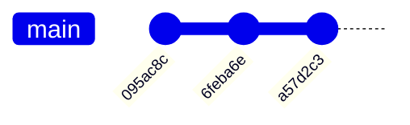
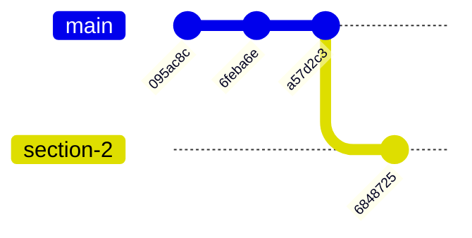
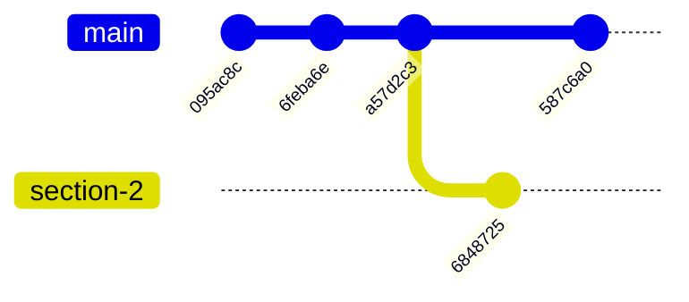
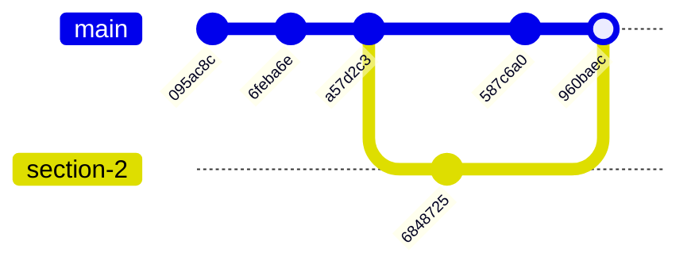
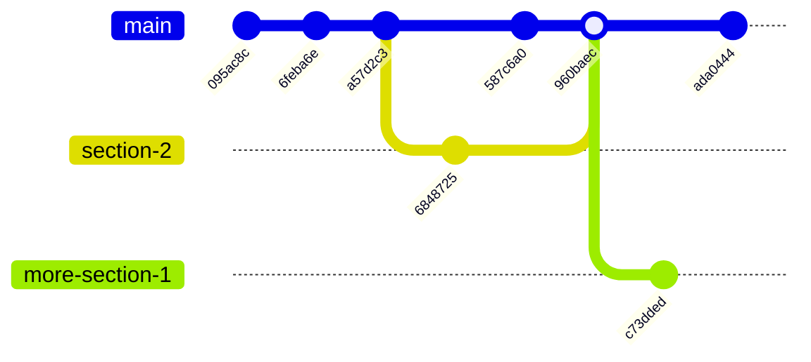
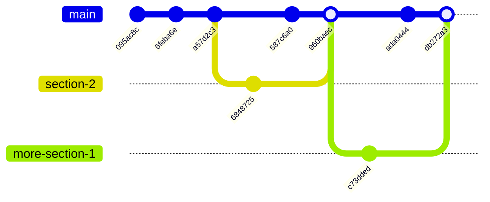

# git, branches et collaboration

Dans le premier tutoriel sur [git et GitHub](./git-github.html), nous avons découvert l'usage *solo* de git.
Cet usage est loin d'être inutile, en offrant :

* une synchronisation entre plusieurs ordinateurs qu'on utilise (votre ordinateur personnel et ceux de l'EPFL, par exemple) ;
* des sauvegardes de tous les moments clefs de votre développement (si vous avez tout cassé et voulez revenir en arrière) ;
* des sauvegardes sur le Web (sur les serveurs GitHub par exemple) au cas où vous perdriez votre travail (ordinateur perdu, détruit ou volé, ou simple accident de suppresion involontaire).

Je l'utilise par exemple moi-même pour tous mes documents LaTeX.

Cependant, le véritable pouvoir de git vient de sa gestion des *branches*, qui permet la *collaboration* à plusieurs sur un même projet.
C'est ce que nous allons découvrir dans ce second (et probablement dernier) tutoriel sur l'utilisation de git.

Nous avons quelque peu "rushé" votre apprentissage de git, de sorte que vous ayez les outils nécessaires pour l'utiliser dans le cadre de votre projet de cours.

## Sommaire

{::options toc_levels="2..3" /}

* This will become a table of contents (this text will be scrapped).
{:toc}

## Créer et manipuler des branches

### Où en étions-nous ?

Avant d'expliquer ce *qu'est* une branche, au juste, nous allons faire quelques manipulations.
N'oubliez pas d'ouvrir un terminal (git bash sur Windows) et de naviguer vers le dossier `tuto-git` que nous avions créé la semaine dernière.
Vous pouvez vérifier que vous êtes au bon endroit avec

```
$ pwd
/.../tuto-git
$ git status
On branch main
Your branch is up to date with 'origin/main'.

nothing to commit, working tree clean
```

Vous pouvez aussi vous rappeler les dernières choses qui se sont passées grâce à `git log` :

```
$ git log --oneline
a57d2c3 (HEAD -> main, origin/main) Seconde section.
6feba6e Add one section.
095ac8c Initial commit.
```

Étudions un peu plus en détail cet affichage.
On peut y voir :

* `a57d2c3`, `6feba6e` et `095ac8c` : les versions courtes des hash SHA-1 qui identifient nos commits.
* Le "titre" (la première ligne) des messages de commits, tels que "Seconde section."
* `(HEAD -> main, origin/main)`.

Cette dernière ligne nous liste des *branches* qui "pointent" vers le commit `a57d2c3`.
Le "pointeur" `HEAD` pointent sur la *branche* `main`, qui elle-même pointe vers le commit.
Une deuxième branche `origin/main` (sur laquelle nous reviendrons plus tard) pointe vers le même commit.

Si on omet `origin/main`, nous pouvons représenter cette situation avec le *graphe de commits* suivant :



### Créer une branche

Il est d'avancer un peu le contenu de la seconde section de notre document.
Pour cela, créons une branche `section-2` avec `git branch` dans laquelle nous allons travailler, puis allons sur cette branche avec `checkout` :

```
$ git branch section-2
$ git checkout section-2
Switched to branch 'section-2'
```

(ces deux opérations peuvent être faites en une seule commande : `git checkout -b section-2`)

Maintenant, étoffons un peu notre second section dans `README.md` :

```diff
 ## Deuxième section

 Un autre paragraphe.
+Nous découvrons tout doucement l'usage des branches avec git.
```

Créons un commit avec ces changements :

```
$ git status
On branch section-2
Changes not staged for commit:
  (use "git add <file>..." to update what will be committed)
  (use "git restore <file>..." to discard changes in working directory)
        modified:   README.md

no changes added to commit (use "git add" and/or "git commit -a")

$ git add -u

$ git commit -m "Nouveau contenu dans la section 2."
[section-2 6848725] Nouveau contenu dans la section 2.
 1 file changed, 1 insertion(+)

$ git log --oneline
6848725 (HEAD -> section-2) Nouveau contenu dans la section 2.
a57d2c3 (origin/main, main) Seconde section.
6feba6e Add one section.
095ac8c Initial commit.
```

On peut voir que `HEAD` pointe désormais sur la branche `section-2`.
C'est le résultat de l'opération `git checkout section-2`.
La branche `section-2` pointe sur notre nouveau commit, alors que `main` est restée en arrière.



### Naviguer entre les branches

Laissons de côté la section 2 pour l'instant.
Prétendons un instant être votre collègue (ou votre *alter ego*) qui a continué à travailler sur la première section dans la branche `main`.

Commençons par retourner sur la branche `main` avec `git checkout` (sans `git branch`/`-b`) :

```
$ git checkout main
Switched to branch 'main'
Your branch is up to date with 'origin/main'.
```

Observez dans votre éditeur que la ligne que nous avions ajoutée à la seconde section a disparu !
C'est normal ; cette modification n'a jamais existé dans la "timeline" de `main`.

Ajoutons une ligne dans la *première* section :

```diff
 ## Une section

 Un paragraphe.
+On dirait que les branches git créent des univers parallèles avec des timelines séparées !

 ## Deuxième section
```

Et créons un commit pour ces changements :

```
$ git add -u

$ git commit -m "Avancement de la première section."
[main 587c6a0] Avancement de la première section.
 1 file changed, 1 insertion(+)
```

Nous avons maintenant la situation suivante, dans laquelle deux "univers parallèles" ont été créés :



Il est ainsi possible de naviguer entre des branches, et d'avancer sur le travail de différentes manières indépendentes.

⚠️ Vérifiez bien (avec `git status`) votre "working directory" est *clean* avant de changer de branche.

### Fusionner des branches

Travailler indépendemment, c'est bien, mais ça ne sert pas à grand chose si on ne peut pas *mettre en commun* le travail plus tard.
C'est là qu'intervient la *fusion* (*merge*) de branches.

Sans git, vous devriez vous échanger vos fichiers par mail (ou, malheureuse génération que vous êtes, par messages What's App).
Vous devriez ensuite être vigilant en intégrant les changements de votre collègue dans votre code.
Si git est si compliqué par ailleurs, c'est ici et maintenant qu'il déploie tout son génie.

Rappelez-vous que nous sommes sur la branche `main`, et qu'il y a des changements qui ont été faits dans l'univers de la branche `section-2`.
Nous voulons maintenant intégrer ces changements à notre branche `main` pour pouvoir continuer.
Cela se fait en une commande magique : `git merge` :

```
$ git branch # on vérifie qu'on est bien sur main
* main
  section-2

$ git merge section-2
```

Cela fait apparaître un éditeur de texte dans lequel vous pouvez introduire un commit message pour le "merge".
git vous propose déjà "Merge branch 'section-2'", ce qui est très bien.
Vous pouvez donc quitter l'éditeur sans rien changer.

> Remarque : ce même mécanisme arrive lorsque vous faites `git commit` sans option `-m`.
> Il vous permet d'écrire un commit message plus long.

```
$ git merge section-2
Auto-merging README.md
Merge made by the 'ort' strategy.
 README.md | 1 +
 1 file changed, 1 insertion(+)
```

Le merge a réussi.
Voyons voir le contenu de notre fichier `README.md` dans notre éditeur.
Il contient bien les changements des deux branches !

```md
# Tutoriel git

C'est mon premier repo git !

## Une section

Un paragraphe.
On dirait que les branches git créent des univers parallèles avec des timelines séparées !

## Deuxième section

Un autre paragraphe.
Nous découvrons tout doucement l'usage des branches avec git.
```

`git log` nous montre également que tous les commits des deux branches, ainsi qu'un "merge commit", sont dans notre historique :

```
$ git log --oneline
960baec (HEAD -> main) Merge branch 'section-2'
587c6a0 Avancement de la première section.
6848725 (section-2) Nouveau contenu dans la section 2.
a57d2c3 (origin/main) Seconde section.
6feba6e Add one section.
095ac8c Initial commit.
```

Il est instructif de demander une vue en graphe avec l'option `--graph` :

```
$ git log --oneline --graph
*   960baec (HEAD -> main) Merge branch 'section-2'
|\
| * 6848725 (section-2) Nouveau contenu dans la section 2.
* | 587c6a0 Avancement de la première section.
|/
* a57d2c3 (origin/main) Seconde section.
* 6feba6e Add one section.
* 095ac8c Initial commit.
```

On voit très clairement l'évolution parallèle des branches, et leur fusion dans un unique commit.
Représentons la même situation avec nos jolis diagrammes :



### Quand la fusion se passe mal : conflits

`git merge` est très fort.
Il peut intégrer des changements faits dans des branches distinctes dans le même fichier, tant que les lignes affectées sont "suffisamment" éloignées (typiquement 3 lignes d'écart).
Il n'est cependant pas tout puissant.
Si les changements des deux branches touchent à la même ligne ou à des lignes très proches (typiquement adjacentes), il est perdu.
C'est ce qu'on appelle un *conflit*.

Commençons par causer une situation de conflit :

1. Faire un changement dans la section 1 dans une branche `more-section-1`.
2. Faire un changement à la même ligne dans la branche `main`.
3. Tenter de merger `more-section-1` dans `main`.

```
$ git checkout -b more-section-1
Switched to a new branch 'more-section-1'
```

Ajoutons une ligne :

```diff
 ## Une section

 Un paragraphe.
 On dirait que les branches git créent des univers parallèles avec des timelines séparées !
+`git merge` est cependant capable d'intégrer les différents univers.

 ## Deuxième section
```

puis créons un commit :

```
$ git add -u
$ git commit -m "More in section 1."
[more-section-1 c73dded] More in section 1.
 1 file changed, 1 insertion(+)
```

Revenons sur `main` :

```
$ git checkout main
Switched to branch 'main'
Your branch is ahead of 'origin/main' by 3 commits.
  (use "git push" to publish your local commits)
```

et modifions la deuxième ligne de la section 1 :

```diff
 ## Une section

 Un paragraphe.
-On dirait que les branches git créent des univers parallèles avec des timelines séparées !
+Incroyable ; on dirait que les branches git créent des univers parallèles avec des timelines séparées !

 ## Deuxième section
```

ce avec quoi nous créons un autre commit :

```
$ git add -u

$ git commit -m "Incroyable."
[main ada0444] Incroyable.
 1 file changed, 1 insertion(+), 1 deletion(-)
```

Nous avons maitenant la situation suivante :



Tentons de merger la branche `more-section-1` :

```
$ git merge more-section-1
Auto-merging README.md
CONFLICT (content): Merge conflict in README.md
Automatic merge failed; fix conflicts and then commit the result.
```

Cette fois, c'est la catastrophe, il y a un conflit.
Il va nous falloir *résoudre* ce conflit pour pouvoir continuer.
Regardons plus en détail *où* se situe le conflit avec `git status` :

```
$ git status
On branch main
Your branch is ahead of 'origin/main' by 4 commits.
  (use "git push" to publish your local commits)

You have unmerged paths.
  (fix conflicts and run "git commit")
  (use "git merge --abort" to abort the merge)

Unmerged paths:
  (use "git add <file>..." to mark resolution)
        both modified:   README.md

no changes added to commit (use "git add" and/or "git commit -a")
```

On peut voir que `README.md` est dans l'état "both modified" : les deux branches ont voulu modifier du contenu trop proche dans ce fichier.
Dans l'éditeur, nous découvrons ceci :

    # Tutoriel git

    C'est mon premier repo git !

    ## Une section

    Un paragraphe.
    <<<<<<< HEAD
    Incroyable ; on dirait que les branches git créent des univers parallèles avec des timelines séparées !
    =======
    On dirait que les branches git créent des univers parallèles avec des timelines séparées !
    `git merge` est cependant capable d'intégrer les différents univers.
    >>>>>>> more-section-1

    ## Deuxième section

    Un autre paragraphe.
    Nous découvrons tout doucement l'usage des branches avec git.

La ligne entre `<<<<<<< HEAD` et `=======` représente l'état tel qu'il était dans `HEAD`, c'est-à-dire `main`.
Les lignes entre `=======` et `>>>>>>> more-section-1` représentent l'état trouvé dans `more-section-1`.

C'est maintenant à vous de résoudre intelligemment le conflit, de sorte à intégrer les changements logiques qui se sont produits dans les deux branches.
Après un peu de réflexion, on décide garder la combinaison suivante :

```
Incroyable ; on dirait que les branches git créent des univers parallèles avec des timelines séparées !
`git merge` est cependant capable d'intégrer les différents univers.
```

On retire alors les marqueurs de conflits (`<<<`, `===`, `>>>`) et on garde le contenu qui nous intéresse :

```md
Un paragraphe.
Incroyable ; on dirait que les branches git créent des univers parallèles avec des timelines séparées !
`git merge` est cependant capable d'intégrer les différents univers.
```

On peut voir la résolution du conflit avec `git diff` :

```
$ git diff
diff --cc README.md
index 637ba0e,ec430af..0000000
--- a/README.md
+++ b/README.md
@@@ -5,7 -5,8 +5,8 @@@ C'est mon premier repo git
  ## Une section

  Un paragraphe.
 -On dirait que les branches git créent des univers parallèles avec des timelines séparées !
 +Incroyable ; on dirait que les branches git créent des univers parallèles avec des timelines séparées !
+ `git merge` est cependant capable d'intégrer les différents univers.

  ## Deuxième section
```

Satisfaits par les changements, nous indiquons à git que nous avons bien résolu le conflit avec `git add` :

```
$ git add README.md
```

Puisqu'il n'y a plus d'autre conflit (ce que nous montre `git status`), nous pouvons valider le merge en cours avec `git commit` :

```
$ git status
On branch main
Your branch is ahead of 'origin/main' by 4 commits.
  (use "git push" to publish your local commits)

All conflicts fixed but you are still merging.
  (use "git commit" to conclude merge)

Changes to be committed:
        modified:   README.md


$ git commit
[main db272a3] Merge branch 'more-section-1'
```

Un `git log --graph --oneline` nous confirme que nous avons tout :

```
$ git log --graph --oneline
*   db272a3 (HEAD -> main) Merge branch 'more-section-1'
|\
| * c73dded (more-section-1) More in section 1.
* | ada0444 Incroyable.
|/
*   960baec Merge branch 'section-2'
|\
| * 6848725 (section-2) Nouveau contenu dans la section 2.
* | 587c6a0 Avancement de la première section.
|/
* a57d2c3 (origin/main) Seconde section.
* 6feba6e Add one section.
* 095ac8c Initial commit.
```

Et graphiquement :



## Collaboration

Maintenant qu'on a mieux appréhendé le concept de branche, revenons à la collaboration entre plusieurs personnes.

Rappelez-vous que nous avions laissé `origin/main` de côté.
Cette branche un peu spéciale représente la branche `main` *sur le remote* `origin`.
On va commencé par "pusher" tout ce que nous avons fait ci-dessus :

```
$ git push
Enumerating objects: 20, done.
Counting objects: 100% (20/20), done.
Delta compression using up to 8 threads
Compressing objects: 100% (12/12), done.
Writing objects: 100% (18/18), 1.60 KiB | 1.60 MiB/s, done.
Total 18 (delta 7), reused 0 (delta 0), pack-reused 0
remote: Resolving deltas: 100% (7/7), done.
To github.com:sjrd/tuto-git.git
   a57d2c3..db272a3  main -> main
```

Cela a mis à jour la branche `main` de `origin` pour qu'elle pointe sur le même commit que *notre* `main`.
Il y a donc bien *2 branches* `main` : une chez nous, une chez `origin`.
C'est pour cela que l'on utilise le *namespace* `origin/main` (la même notion de "namespace" que `std::` en C++).
Ces branches ne pointent pas forcément sur le même commit.

### Donner accès à votre binôme

À partir de maintenant, nous vous conseillons de continuer ce tutoriel en binôme.

Sur GitHub, votre repo est privé.
Votre collègue de binôme ne peut donc pas y avoir accès : il ou elle ne peut pas le voir sur GitHub, et ne peut pas non plus le cloner.
C'est bien sûr nécessaire pour protéger vos solutions de vos collègues (et des générations futures d'étudiants), mais ça ne va pas être pratique pour votre projet.
Nous allons donc remédier à ça.

Choisissez l'un ou l'une d'entre vous, qui partagera son repo `tuto-git` avec l'autre.
Disons que c'est Alice qui va partager son repo avec Bob.

Alice va sur GitHub, sur la page de son repo `tuto-git`.
Dans l'onglet "⚙️ Settings", sélectionnez "Collaborators" dans la colonne de gauche.
Vous devrez peut-être confirmer votre login, car vous entrez dans une zone importante pour la sécurité de votre compte.
Vous devriez voir un panneau indiquant "You haven't invited any collaborators yet".

Cliquez sur le bouton "Add people".
Entrez maintenant le username GitHub de Bob.
Vérifiez que vous avez bien le bon, et validez.

Bob reçoit alors une *Invitation* à collaborer sur ce projet.
L'invitation arrivera dans son Inbox GitHub et/ou par e-mail.
Acceptez l'invitation, ce qui vous amène sur la page GitHub du `tuto-git` d'Alice.

Cliquez sur le bouton vert "Code" pour obtenir l'URL SSH `git@...`.
Utilisez-la dans une commande `git clone` depuis votre dossier `projets` (*pas* depuis votre `tuto-git`).
Puisque vous avez déjà un dossier nommé `tuto-git`, cette fois-ci il va falloir dire à git de nommer votre clone local différemment :

```
$ pwd
/.../projets

$ git clone git@.../tuto-git.git tuto-git-alice
Cloning into 'tuto-git-alice'...
remote: Enumerating objects: 27, done.
remote: Counting objects: 100% (27/27), done.
remote: Compressing objects: 100% (10/10), done.
remote: Total 27 (delta 9), reused 25 (delta 7), pack-reused 0 (from 0)
Receiving objects: 100% (27/27), done.
Resolving deltas: 100% (9/9), done.
```

Ça y est, vous avez désormais tous les deux un clone local du *même* repo remote.
Vous pouvez tous les deux utiliser `git push` et `git pull` pour synchroniser votre travail local.

### Travail indépendant

Vos branches `main` locales sont bien sûr indépendantes.
Vous pouvez chacune et chacun développer en parallèle sur votre machine, effectuer des commits.
Vous pouvez d'ailleurs faire cela sans même de connexion Internet, ce qui est très pratique si vous vous isolez une semaine à la montagne.
Seules les commandes `git push` et `git pull` (et `git fetch`, voir plus loin) se connectent à Internet.

Que se passe-t-il lorsque vous voulez synchroniser des changements faits en parallèle ?
Et bien nous allons voir.

Faites tous les deux des changements dans `README.md`, dans des sections différentes.
Puis, faites-en des commits, avant de les synchroniser avec `git push`.

Si c'est Bob qui fait son `git push` en premier, il va réussir.
Quand Alice effectue `git push` à son tour, git refusera de mettre à jour `origin/main`, car cela *perdrait* le travail de Bob !

```
$ git push
To github.com:sjrd/tuto-git.git
 ! [rejected]        main -> main (fetch first)
error: failed to push some refs to 'github.com:sjrd/tuto-git.git'
hint: Updates were rejected because the remote contains work that you do
hint: not have locally. This is usually caused by another repository pushing
hint: to the same ref. You may want to first integrate the remote changes
hint: (e.g., 'git pull ...') before pushing again.
hint: See the 'Note about fast-forwards' in 'git push --help' for details.
```

Admirez au passage ce magnifique message d'erreur qui vous explique non seulement le problème, mais aussi comment vous débloquer :

> You may want to first integrate the remote changes (e.g., 'git pull ...') before pushing again.

Alice doit donc faire un `git pull` pour synchroniser son `main` local avec `origin/main`.
Mais ! N'aura-t-on pas le même problème ?
Non, car localement, `git pull` va faire un *merge* de `origin/main` (qui n'est rien d'autre qu'une brance).
En fait, `git pull` est un raccourci pour deux commandes : `git fetch` puis `git merge origin/main`.
`git fetch` est la partie qui se connecte à Internet pour synchroniser *une copie locale* de `origin/main`.
Cela réussit, puisque `origin/main` est restée derrière, à un point commun entre Alice et Bob.
Ensuite, le `merge` intègre les changements :

```
$ git fetch
remote: Enumerating objects: 5, done.
remote: Counting objects: 100% (5/5), done.
remote: Compressing objects: 100% (1/1), done.
remote: Total 3 (delta 1), reused 3 (delta 1), pack-reused 0 (from 0)
Unpacking objects: 100% (3/3), 311 bytes | 18.00 KiB/s, done.
From github.com:sjrd/tuto-git
   db272a3..e2a1e70  main       -> origin/main

sjrdo@Ludivine MINGW64 ~/Documents/Projets/tuto-git (main)
$ git merge origin/main
Auto-merging README.md
Merge made by the 'ort' strategy.
 README.md | 1 +
 1 file changed, 1 insertion(+)
```

À ce moment, il est bon de vérifier que la fusion a donné un résultat cohérent.
Si c'est votre projet, par exemple, il serait bien de re-tester votre code !
Ensuite, si tout est bon, Alice peut retenter le `git push` :

```
$ git push
Enumerating objects: 10, done.
Counting objects: 100% (10/10), done.
Delta compression using up to 8 threads
Compressing objects: 100% (4/4), done.
Writing objects: 100% (6/6), 621 bytes | 621.00 KiB/s, done.
Total 6 (delta 2), reused 0 (delta 0), pack-reused 0
remote: Resolving deltas: 100% (2/2), completed with 1 local object.
To github.com:sjrd/tuto-git.git
   e2a1e70..6363300  main -> main
```

Cette fois, `git push` est accepté, car *l'historique* de `main` contient bien le commit pointé par `origin/main`, que Bob avait synchronisé.
Cet historique garantit que les changements apportés par Bob ont bien été intégrés à la branche `main` d'Alice.

Une fois ceci fait, Bob peut récupérer à son tour cette version fusionnée avec `git pull`.

### En cas de conflit

Répétez la manoeuvre, mais cette fois modifiez la même ligne.
Par exemple, Alice peut faire un `git push` avec un nouveau commit, puis Bob tente de faire de même.
Au moment pour Bob de faire `git pull` (ou `git merge origin/main`), il se verra face à un *conflit*.
Ce sera alors à Bob de régler ce conflit, comme nous l'avons fait plus haut, avant de pouvoir continuer son `git push`.

## Conclusion

Voilà !
Vous connaissez désormais les bases de git, qui vous permettront de collaborer efficacement sur le même projet.

Avant de vous laisser, voici un petit rappel des terminologies :

* Un **commit** est une version pérenne, validée de l'état du projet.
  Chaque commit est identifié par son **hash SHA-1**.
* Une **branche** est un pointeur nommé, qui pointe vers un commit.
* (On ne l'a pas dit avant mais) chaque commit pointe aussi vers son **parent**, le commit qui le précéde dans l'historique.
* Un **merge commit** est le résultat d'un merge.
  Un merge commit possède *deux* parents.
* L'**historique** contient tous les commits de l'histoire du projet.
  Elle est construite en suivant les "pointeurs parent".
  À cause des merge commits qui ont deux parents, l'historique forme un *graphe dirigé acyclique* de commits.
* Un **conflit** se produit lorsqu'on tente de merger deux branches qui ont modifié des lignes trop proches dans un même fichier.
  Il faut **résoudre** les conflits avant de pouvoir finaliser le merge avec `git commit`.

### Pour aller plus loin

* [Documentation de GitHub sur l'usage de git](https://docs.github.com/fr/get-started/using-git)
* [Lisez le livre "Pro Git"](https://git-scm.com/book/en/v2), qui est la référence ultime à propos de git
